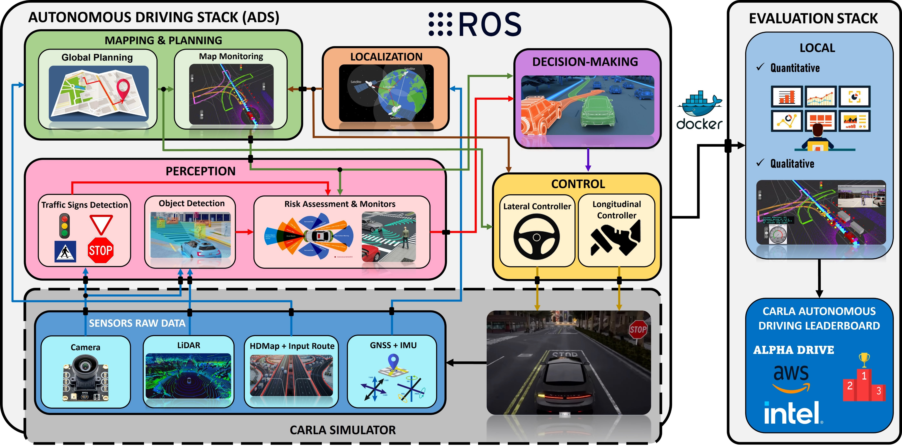

# RobeSafe research group Autonomous Driving Stack (ADS)

@inproceedings{robesafe_ads,
  title={How to build and validate a safe and reliable Autonomous Driving stack? A ROS based software modular architecture baseline},
  author={Gómez-Huélamo, Carlos and Díaz-Díaz, Alejandro and Araluce, Javier and Ortíz-Huamaní, Miguel E., Gutiérrez-Moreno, Rodrigo and Arango, Felipe and Llamazares, Ángel and Bergasa, Luis M.},
  booktitle={2022 IEEE Intelligent Vehicles Symposium (IV): In submission},
  year={2022},
  organization={IEEE}
}



## Overview
The implementation of Autonomous Driving stacks (ADS) is one of the most challenging engineering tasks of our era. Autonomous Vehicles (AVs) are expected to be driven in highly dynamic environments with a reliability greater than human beings and full autonomy. Furthermore, one of the most important topics is the way to democratize and accelerate the development and research of holistic validation to ensure the robustness of the vehicle. In this paper we present a powerful ROS (Robot Operating System) based modular ADS that achieves state-of-the-art results in challenging scenarios based on the CARLA (Car Learning to Act) simulator, outperforming several strong baselines in a novel evaluation setting which involves non-trivial traffic scenarios and adverse environmental conditions ([Qualitative Results](https://cutt.ly/SPyu0lU)). Our proposal ranks in second position in the CARLA Autonomous Driving Leaderboard (Map Track) and gets the best score considering modular pipelines, as a preliminary stage before implementing it in our real-world autonomous electric car.
%Our ADS is built towards meeting the requirements to commit the least number of traffic infractions which can be summarized as: Global planning based on the A* algorithm, control layer uses waypoints and Linear-Quadratic Regulator (LQR) algorithm, Hierarchical Interpreted Binary Petry Nets (HIBPNs) to model the behavioural processes, GNSS and IMU to conduct the localization step and a combination of perception pipelines for obstacle detection, traffic signs detection and risk assessment based on LiDAR, Camera and High-Definition (HD) Map information.
To encourage the use research in holistic development and testing, our code is publicly available at [Code](https://github.com/RobeSafe-UAH/CARLA_Leaderboard).

## Requirements

Note that due to ROS1 limitations (till Noetic version), specially in terms of TF ROS package, we limited the Python version to 2.7. Future works will integrate the code using ROS1 Noetic or ROS2, improving the version to Python3.

- Python3.8 
- Numpy
- ROS Noetic
- HD map information (Monitorized lanes)
- Keras==2.2.4
- OpenCV==4.1.2
- filterpy==1.4.5
- scikit-image==0.17.2
- lap==0.4.0

## Get Started and Usage
Coming soon ...
## Quantitative results
Coming soon ...
## Qualitative results
[Qualitative Results](https://cutt.ly/SPyu0lU)

**How to clone this repository?**
```
(In your host)
cd ~
git clone --recursive -b 2021_carla_challenge git@github.com:RobeSafe-UAH/CARLA_Leaderboard.git team_code 
cd team_code/build_image 
./make_docker.sh carla_challenge_2021:latest ssh_user (e.g. ./make_docker.sh carla_challenge_2021:latest your_user) 
```